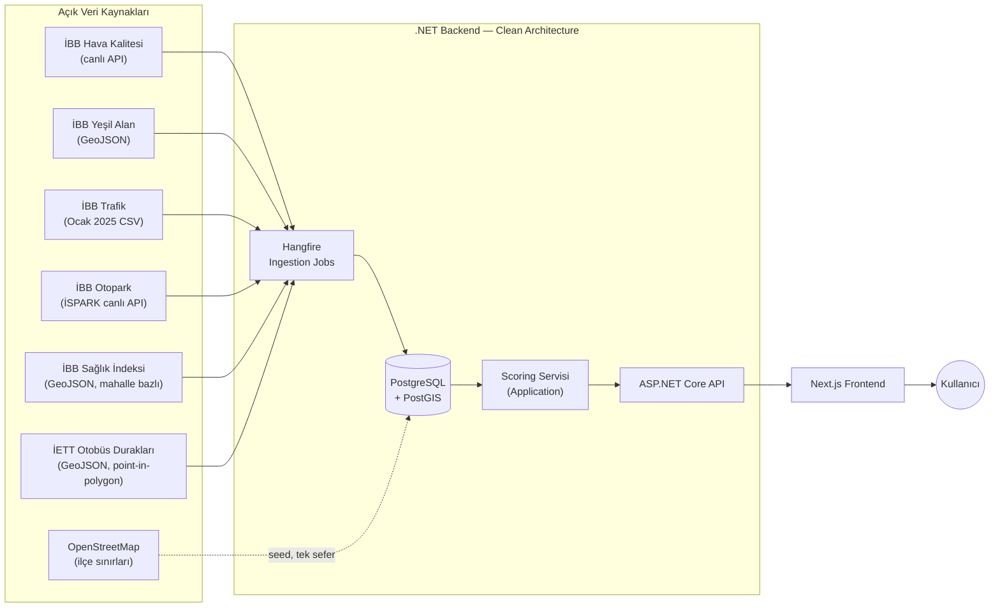
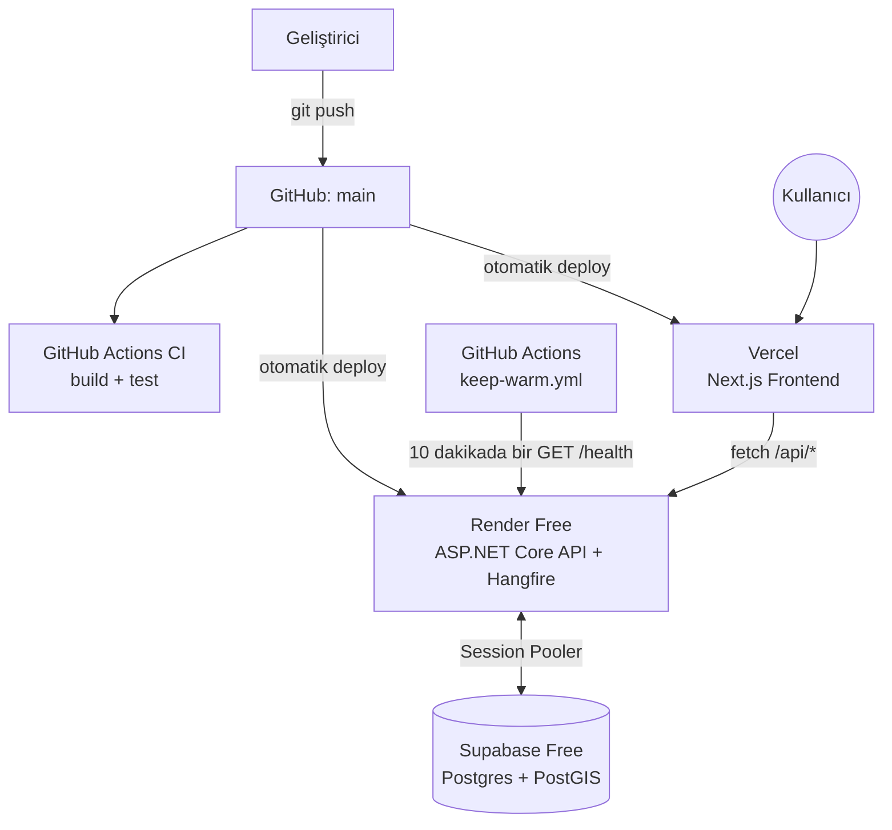

# SemtSkoru


İstanbul'un 39 ilçesini gerçek İBB (İstanbul Büyükşehir Belediyesi) açık verisiyle keşfetmeni sağlayan açık kaynak bir web uygulaması. Bir ilçenin hava kalitesi, yeşil alan erişimi, trafik/ulaşım durumunu, otopark erişimini, sağlık hizmetlerine erişimini ve toplu taşıma erişimini 0-100 arası skorlara çevirir, iki ilçeyi yan yana karşılaştırır. İstanbul'un tüm **39 ilçesini** kapsar — hava kalitesi verisi yalnızca gerçek bir İBB istasyonu bulunan 18 ilçede, otopark verisi yalnızca gerçek bir İSPARK tesisi bulunan 34 ilçede mevcuttur; kalan ilçelerde bu boyutlar dürüstçe "Veri yok" olarak işaretlenir (sağlık erişimi ve toplu taşıma erişimi verisi ise gerçekten 39 ilçenin tamamını kapsıyor — bkz. [`docs/data-sources.md`](docs/data-sources.md)).

## Özellikler

- Bir ilçenin Hava Kalitesi / Yeşil Alan / Ulaşım / Otopark / Sağlık Erişimi / Toplu Taşıma Erişimi skorlarını ve genel skorunu görüntüleme
- İki ilçeyi yan yana karşılaştırma, sınırlarını interaktif haritada görme
- Skor kartını PNG görsel olarak indirme veya native paylaşım menüsüyle (varsa) doğrudan paylaşma
- Her skor kartında verinin hangi kaynaktan geldiği ve ne zamana ait olduğu açıkça görünür
- Bir veri kaynağı beklenenden eski kaldığında ("bayat veri") veya doğası gereği canlı olmadığında ("tarihsel veri") UI'da açıkça işaretlenir — hiçbir veri, öyle olmadığı sürece "canlı" diye sunulmaz

## Mimari

Dış veri kaynaklarına yalnızca backend'in ingestion katmanı erişir; frontend hiçbir zaman doğrudan İBB'ye istek atmaz. Her ingest edilen kayıt kaynak adı/URL/lisans/yayın tarihi/son senkronizasyon zamanı metadata'sı taşır.



**Backend** — ASP.NET Core (.NET 10), Clean Architecture (Domain → Application → Infrastructure → Api): dış katmanlar iç katmanlara bağımlı, tersi değil.

**Frontend** — Next.js (App Router) + TypeScript, sunucu tarafında hiçbir zaman doğrudan veri kaynağına gitmez, yalnızca backend API'sini tüketir.

API, paylaşılan DB bağlantı havuzunu korumak için global bir eşzamanlılık limiti, kötüye kullanıma karşı da endpoint başına IP bazlı sliding-window rate limiting uygular.

## Tech Stack

| Katman | Teknoloji | Neden |
|---|---|---|
| Backend framework | ASP.NET Core (.NET 10) | Minimal API'ler, native OpenAPI desteği |
| Mimari | Clean Architecture | Domain hiçbir dış bağımlılığa sahip değil; kaynak/DB değişimi izole |
| ORM | EF Core + Npgsql | PostGIS geometry tipleriyle native entegrasyon |
| Coğrafi veri | PostgreSQL + PostGIS, NetTopologySuite | İlçe sınırları, mesafe hesapları (Haversine) |
| Zamanlanmış işler | Hangfire (+ Postgres storage) | Günlük/haftalık/aylık ingestion job'ları |
| API dokümantasyonu | Scalar (OpenAPI) | Sıfır ekstra paket, .NET'in native `AddOpenApi()`'si üzerine |
| Frontend framework | Next.js 16 (App Router) + TypeScript (strict) | Sunucu/istemci bileşen ayrımı, dosya tabanlı routing |
| Data fetching | TanStack Query | Cache, loading/error state yönetimi |
| Harita | MapLibre GL JS + OSM raster tile'ları | Ücretsiz, açık kaynak, vendor lock-in yok |
| Stil | Tailwind CSS 4 | Utility-first, hızlı iterasyon |
| Test (backend) | xUnit, Testcontainers | Gerçek Postgres+PostGIS'e karşı integration test |
| Test (frontend) | Vitest, React Testing Library, Playwright | Component + gerçek tarayıcıda e2e |
| CI/CD | GitHub Actions | PR'larda build+test, `main`'e push'ta otomatik |
| Barındırma | Vercel + Render + Supabase | Tamamen ücretsiz katmanlar (bkz. [Yayına Alma](#yayına-alma)) |

## Proje Yapısı

```
/backend
  global.json                     → .NET SDK sürüm pin'i (reproducible build)
  src/
    SemtSkoru.Domain/          → Entity ve value object'ler (Neighborhood, Score, DataSourceMetadata)
    SemtSkoru.Application/     → Scoring servisi
    SemtSkoru.Infrastructure/  → EF Core, dış API client'ları, Hangfire ingestion job'ları
    SemtSkoru.Api/             → ASP.NET Core Web API, endpoint'ler
  tests/                          → xUnit (Domain/Application unit, Api Testcontainers integration)
  Dockerfile                      → Render deploy'u için multi-stage build
/web
  app/                            → Next.js sayfaları (arama, ilçe detay, karşılaştırma)
  components/                     → Skor kartı, karşılaştırma tablosu, harita, bayat-veri rozeti
  lib/                            → API client, TanStack Query hook'ları
  e2e/                            → Playwright kritik yol testi
docs/
  data-sources.md                 → Her veri kaynağının canlı doğrulanmış endpoint/lisans/güncellik bilgisi
  deployment.md                   → Ücretsiz katmanlarla adım adım yayına alma
render.yaml                       → Render Blueprint (Docker web service tanımı)
.github/workflows/                → CI (build+test), deploy-frontend (Vercel CLI ile otomatik deploy) ve keep-warm (free-tier soğuk başlangıç önleme + ingestion catch-up)
SPEC.md, tasks/plan.md, tasks/todo.md → Ürün spesifikasyonu ve uygulama planı
```

## Kurulum (yaklaşık 5 dakika)

Önkoşullar: .NET 10 SDK, Node.js 20+, Docker (Docker Desktop veya Colima).

```bash
# 1. Yerel geliştirme şifresini ayarla (.env gitignore'da; gerçek şifreler asla commit edilmez)
cp .env.example .env
# .env içindeki POSTGRES_PASSWORD değerini kendi şifrenizle değiştirin

# 2. Postgres+PostGIS'i ayağa kaldır
docker compose up -d

# 3. Backend: connection string'i user-secrets'a kaydet (.env'deki şifreyle aynı olmalı),
#    EF Core aracını geri yükle, migration'ları uygula, API'yi çalıştır
cd backend
dotnet user-secrets set "ConnectionStrings:Default" \
  "Host=localhost;Port=5432;Database=semtskoru;Username=semtskoru;Password=<.env'deki şifre>" \
  --project src/SemtSkoru.Api
dotnet tool restore
dotnet tool run dotnet-ef database update \
  --project src/SemtSkoru.Infrastructure --startup-project src/SemtSkoru.Api
dotnet run --project src/SemtSkoru.Api
# API: http://localhost:5169  ·  API dokümantasyonu: http://localhost:5169/scalar/v1
```

```bash
# 4. Frontend (yeni bir terminalde)
cd web
npm install
npm run dev
# Uygulama: http://localhost:3000
```

Migration'lar İstanbul'un 39 ilçesini gerçek sınır verisiyle (OpenStreetMap) otomatik olarak seed eder. Skorlar, arka planda çalışan Hangfire ingestion job'ları (hava kalitesi ve otopark günlük, yeşil alan/sağlık erişimi/toplu taşıma erişimi haftalık, trafik aylık) gerçek veriyi çektikçe dolar; job'ları hemen tetiklemek isterseniz API'nin Hangfire panosundan (`/hangfire`, sadece Development ortamında) manuel çalıştırabilirsiniz.

AI Semt Asistanı (`/asistan`, `POST /api/asistan`) isteğe bağlıdır ve anahtar olmadan da uygulamanın geri kalanını bozmadan 503 döner. Yerelde denemek için [Google AI Studio](https://aistudio.google.com/apikey)'dan ücretsiz bir anahtar alıp user-secrets'a ekleyin:

```bash
dotnet user-secrets set "Gemini:ApiKey" "<anahtarınız>" --project src/SemtSkoru.Api
```

## Testler

```bash
# Backend: 124 test (unit + Testcontainers ile gerçek Postgres'e karşı integration)
cd backend && dotnet test

# Frontend: unit/component testleri (Vitest + React Testing Library)
cd web && npm test

# Frontend: uçtan uca kritik yol testi (gerçek backend + frontend + Postgres'e karşı, Playwright)
cd web && npm run test:e2e
```

## Yayına Alma

Barındırma bütçesi olmadığından proje tamamen ücretsiz katmanlar üzerinde çalışır: Vercel (frontend), Render (API, Docker), Supabase (Postgres+PostGIS).



Render'ın ücretsiz planı ~15 dakika hareketsizlikten sonra container'ı durdurur; `keep-warm.yml` her 10 dakikada bir uyandırıp soğuk başlangıcı önler, Hangfire da süresi geçmiş ingestion job'larını kendiliğinden kuyruğa alır. Adım adım kurulum (Supabase → Render → Vercel → GitHub secret) için bkz. [`docs/deployment.md`](docs/deployment.md).

## Veri Kaynakları ve Lisansları

Her kaynak, kod yazılmadan önce gerçek bir HTTP isteğiyle doğrulandı — bkz. [`docs/data-sources.md`](docs/data-sources.md) tam detay için.

| Boyut | Kaynak | Güncellik | Lisans |
|---|---|---|---|
| Hava Kalitesi | İBB Açık Veri Portalı (canlı API) | Saatlik | İBB Açık Veri Lisansı |
| Yeşil Alan | İBB Açık Veri Portalı (GeoJSON) | Yıllık | İBB Açık Veri Lisansı |
| Trafik/Ulaşım | İBB Açık Veri Portalı (Ocak 2025 CSV) | Tarihsel — canlı değil, UI'da açıkça etiketli | İBB Açık Veri Lisansı |
| Otopark | İBB İSPARK Açık Veri Portalı (canlı API) | Canlı | İBB Açık Veri Lisansı |
| Sağlık Erişimi | İBB 34 Dakika İstanbul Sağlık İndeksi (GeoJSON) | Durağan — kaynak 2024'ten beri güncellenmedi, haftalık yeniden çekiliyor | İBB Açık Veri Lisansı |
| Toplu Taşıma Erişimi | İETT Otobüs Durakları Verisi (GeoJSON) | Durağan — altyapı yavaş değişir, haftalık yeniden çekiliyor | İBB Açık Veri Lisansı |
| İlçe sınırları | OpenStreetMap / Nominatim | Statik (seed-time'da bir kez çekildi) | [ODbL](https://opendatacommons.org/licenses/odbl/) |

Harita verileri © [OpenStreetMap katkıda bulunanları](https://www.openstreetmap.org/copyright), ODbL lisansı altında.

## Lisans

MIT — bkz. [LICENSE](LICENSE). Yukarıdaki açık veri kaynaklarının kendi lisansları ayrıca geçerlidir; ODbL atıf zorunluluğu için bkz. yukarısı.

## Claude Code ile geliştirildi

Bu proje AI coding agent'larıyla (Claude Code), [addyosmani/agent-skills](https://github.com/addyosmani/agent-skills) yaşam döngüsü (spec → plan → build → test → review → ship) kullanılarak geliştirildi. İçerik (v0.6.9, MIT lisanslı, bkz. [.claude/agent-skills-LICENSE](.claude/agent-skills-LICENSE)) `.claude/` dizinine vendor edildi — bu repoyu Claude Code'da açan herkes otomatik alır, ekstra kurulum gerekmez:

- `.claude/skills/` — yaşam döngüsü skill'leri (spec, plan, build, test, review, ship ve daha fazlası) + [supabase/agent-skills](https://github.com/supabase/agent-skills)
- `.claude/agents/` — 4 reviewer persona (`code-reviewer`, `security-auditor`, `test-engineer`, `web-performance-auditor`)
- `.claude/commands/` — slash komutlar (`/spec`, `/plan`, `/build`, `/test`, `/constraints`, `/review`, `/code-simplify`, `/ship`, `/webperf`)
- `.claude/references/` — skill'lerin kullandığı ortak kontrol listeleri (güvenlik, performans, erişilebilirlik, test, gözlemlenebilirlik)
